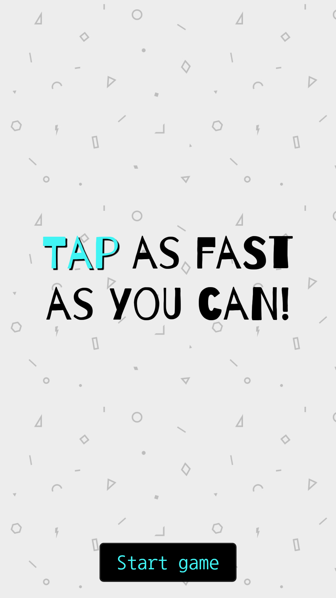
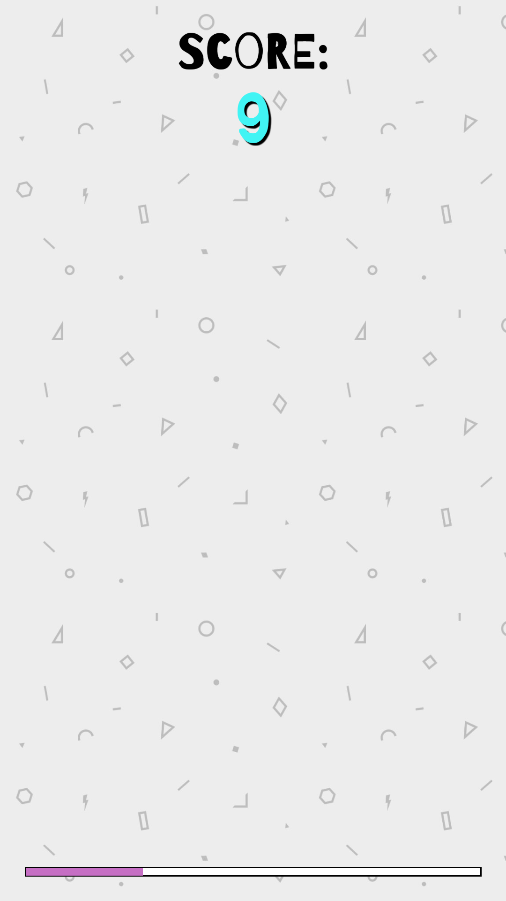
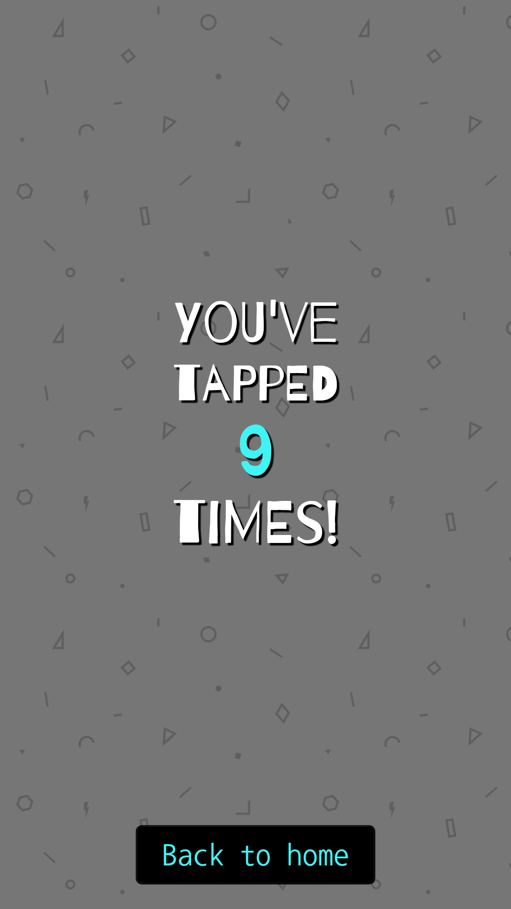

# The tap tap game

One rule: Be the fastest!
This simple tap game consists in touching the screen as many times as possible in a limited amount of time (10 seconds).

## Screenshots

  </img>
  </img>
  </img>

## History

I decided to create this application to initiate myself to the React-Native developement.

## TODO

This game sure has improvements to be made:
- Add a countdown before starting the game
- Test the game on IOS and on tablet
- Store the highest scores in a database
- Add several difficulties modes: a longer time to tap, random apparition of "trapped" tiles where the player has to avoid clicking, ...